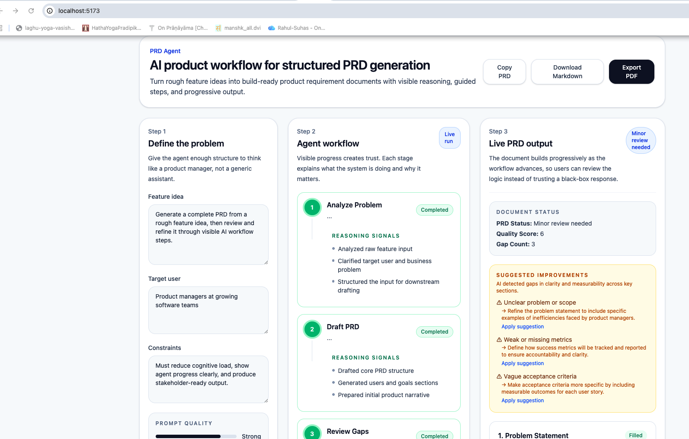

# AI-Driven PRD Copilot
> 🚀 Agentic AI system that transforms rough product ideas into structured, review-ready PRDs with built-in critique and refinement.


## 🧠 From Idea → Structured Product Thinking
Most product managers don’t struggle with ideas.  
They struggle with turning ideas into something a team can actually build.

This project is an **agentic AI workflow** that transforms a rough feature idea into a structured, review-ready Product Requirements Document (PRD).

---

## ✨ What This Does

- Converts rough ideas → structured PRDs  
- Applies automated quality scoring  
- Identifies gaps in clarity, metrics, and scope  
- Generates actionable improvements  
- Exports to UI, Markdown, and PDF  

---

## 🎥 Demo

1. Input a rough feature idea  
2. System runs multi-stage pipeline  
3. Generates structured PRD  
4. Evaluates quality and identifies gaps  
5. Suggests improvements  
6. Exports to PDF  

### UI


### 🔹 Generated PRD (Markdown / PDF)

Structured, review-ready output with quality scoring and improvement suggestions

[PRD Preview](./screenshots/UI-Output.md)

👉 [Download Full PRD PDF](./screenshots/PDF-Output.pdf)
---

## 🧠 How It Works

Analyze → Draft → Review → Refine → Output

Each stage hands off to the next, creating a **critique → improve loop** similar to how strong product teams operate.
---

## ⚡ Why This Is Different

Most AI tools rely on a single prompt.

This system is built as a **multi-agent workflow**:

- Each stage has a defined role  
- Outputs become structured inputs  
- Quality improves across iterations  
- Thinking is visible, not hidden  

👉 This makes PRD creation more consistent, reviewable, and scalable.

---
### Pipeline Stages

- **Analysis Agent** → Understands intent and context  
- **Draft Agent** → Generates full PRD  
- **Review Agent** → Scores quality + identifies gaps  
- **Finalize Agent** → Refines using feedback  
- **Formatter** → Converts to Markdown/UI/PDF  

---

## 🏗️ Tech Stack

**Frontend**
- React (Vite)
- Tailwind CSS

**Backend**
- Node.js
- Express
- LLM APIs (OpenAI or equivalent)

**Data**
- Structured JSON pipeline  
- Deterministic formatting layer  

---

## 📊 Output Example

- **PRD Status:** Minor review needed  
- **Quality Score:** 6  
- **Gap Count:** 3  

### Suggested Improvements

- Unclear problem → refine scope  
- Weak metrics → add measurable success criteria  
- Vague acceptance criteria → increase specificity  

---

## 🧩 Key Files

/frontend
PRDAgentFlowUI.jsx → UI rendering + improvements

/backend
prompt.js → LLM prompts (core logic)
format.js → Markdown generation

---

## 🔧 Setup

1. Clone the repository  
2. Create a `.env` file in the root directory  
3. Add your OpenAI API key:

   ```
   OPENAI_API_KEY=your_openai_api_key_here
   ```

4. Install dependencies and run the application  

---

## 🔐 Environment Variables

This project requires an OpenAI API key.

- Your API key is **not stored or shared**
- Each user must provide their own key via `.env`

A sample configuration is available in:

```
.env.example
```

---

> Designed as a structured, agentic workflow for PRD generation, not just a prompt-based tool.
## ⚙️ Running Locally

---
### Backend (bash)
- cd src
- npm install
- node server.js

###  Frontend (bash)
- cd ui
- npm install
- npm run dev

Then open:
http://localhost:5173

---
## 🐛 Debugging Guide

| Issue | Where to Check |
|------|---------------|
| UI blank | React component |
| Missing improvements | review object |
| Bad output quality | prompt.js |
| Formatting issues | format.js |

---

## 🎯 Why This Matters

This is not a PRD generator.

It’s a **product thinking system** that:
- standardizes how PRDs are created  
- reduces cognitive load  
- improves consistency across teams  

👉 Unlike typical AI tools, this is not a single prompt. It is a structured, multi-agent reasoning system.

---
## 📈 Impact

- Reduced PRD creation time from hours to minutes  
- Improved consistency across documents  
- Enabled structured, reviewable product thinking  
## 🔮 Roadmap

- Apply suggestions (auto-refine sections)  
- Section-level regeneration  
- Editable PRD blocks  
- Jira / Notion integrations  

---
## 🧭 Positioning

**AI Product System: Agentic PRD Copilot**

From idea → structured, scalable product thinking.
